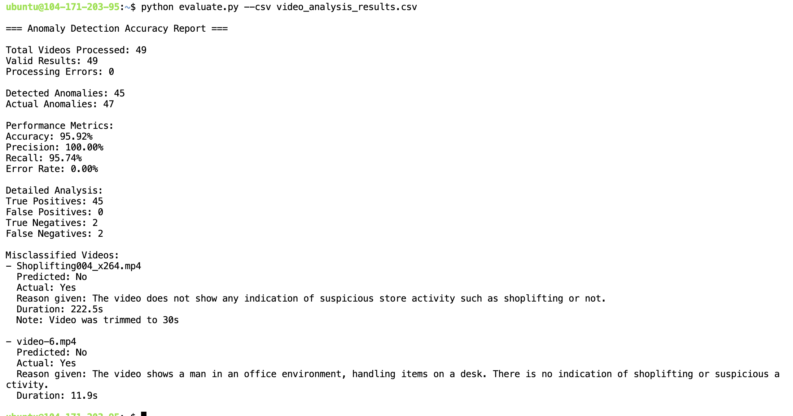

# Evaluating Shop Activity Detection

## Step 1: Ingest evaluation data
```bash
pip install gdown
gdown "https://drive.google.com/uc?export=download&id=1efhs3XDSPTnHyNZbTjSU-1jjI1H-zr_i"
unzip shoplifting-videos.zip
```

## Step 2: Curate your responses
Responses gotten from the model/method should be organized in a `csv` with at least the following columns
  - filename
  - anomaly

Example
| Filename                | Anomaly |
|-------------------------|---------|
| Shoplifting052_x264.mp4 | Yes     |
| Shoplifting034_x264.mp4 | No     |
| Shoplifting004_x264.mp4 | Yes     |

Where `Yes` represents an anomalous case like theft and `No` represents a normal case.

## Run evaluation script 
```bash
python evaluate.py --csv result.csv
```

`result.csv` should be your curated csv

## Sample result

